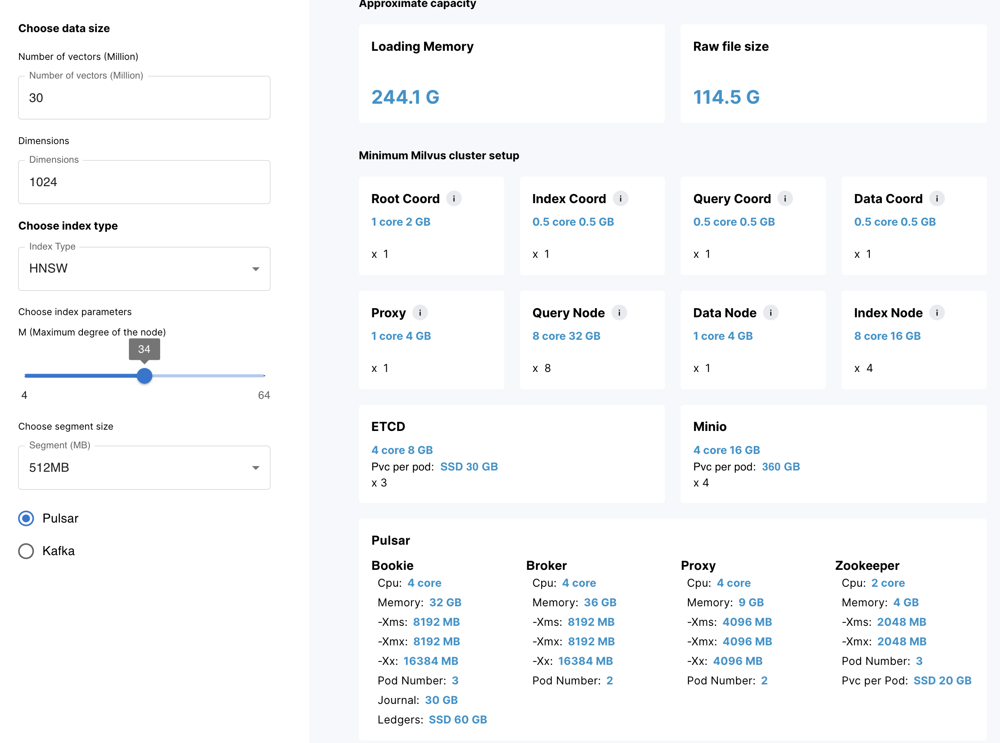

# Milvus 向量数据库集群

## 1. 概述

Milvus创建于2019年，其唯一目标是存储、索引和管理由深度神经网络和其他机器学习（ML）模型生成的大量嵌入向量。

作为一个专门设计用于处理输入向量查询的数据库，它能够在万亿规模上索引向量。与现有的关系数据库不同，Milvus主要按照预定义的模式处理结构化数据，它是自下而上设计的，用于处理从非结构化数据转换而来的嵌入向量。

随着互联网的发展和演变，非结构化数据变得越来越常见，包括电子邮件、论文、物联网传感器数据、Facebook照片、蛋白质结构等等。为了让计算机理解和处理非结构化数据，这些数据使用Embedding技术转换为矢量。Milvus存储并索引这些向量。Milvus能够通过计算两个向量的相似距离来分析它们之间的相关性。如果两个嵌入向量非常相似，则意味着原始数据源也相似。


我们拟在26台主机上进行集群版Milvus的搭建及测试，集群的详细细节参考后续内容。Milvus向量数据的搭建是一个非常复杂且繁琐的工作，其复杂程度远超常规的如Hadoop、Zookeeper、Redis、Elsatic Search等集群的搭建。此外，官方并没有给出详细的部署教程，值给出了单机部署的Docker Compose配置文件，以及集群版的Helm Charts文件，集群版和单机版有较大的差别。因此我们需要将Helm Charts文件dump成标准的K8s YAML声明式配置方式，仔细读取其中的配置项，自己去捋清楚Miluvs集群各个节点角色的相互依赖关系，配置文件dump方法如下：

```bash
# 1. 添加Milvus Helm仓库
helm repo add milvus https://zilliztech.github.io/milvus-helm/
helm repo update

# 2. 将Milvus Helm Charts dump成yaml
helm template my-release milvus/milvus > milvus-k8s-cluster.yaml
```

我们已经将其配置文件dump出来并存放于: [/conf/milvus/milvus-k8s-cluster.yaml](./conf/milvus/milvus-k8s-cluster.yaml). 该文件内容较多，建议查看之前，现学习一定的Kubernetes知识.


本仓库旨在详细介绍26台主机的角色规划和记录整个Milvus向量数据库的详细搭建文档。我们给出了详细的搭建过程，甚至给出了详细的配置文件、脚本等，方便后续的工作开展。


## 2. 集群架构

作为云原生矢量数据库，Milvus通过设计将存储和计算分离。为了增强弹性和灵活性，Milvus的所有组件都是无状态的。Milvus建立在Faiss、Annoy、HNSW等流行向量搜索库之上，旨在对包含数百万、数十亿甚至数万亿向量的密集向量数据集进行相似性搜索。在继续之前，请熟悉嵌入检索的基本原理。

Milvus还支持数据分片、数据持久化、流数据摄取、矢量和标量数据之间的混合搜索、时间旅行(v2.3.0版本后移除)以及许多其他高级功能。该平台按需提供性能，并可进行优化以适应任何嵌入检索场景。我们建议使用Kubernetes部署Milvus，以获得最佳可用性和弹性。

Milvus采用共享存储架构，其特征是存储和计算分解以及计算节点的水平可扩展性。遵循数据平面和控制平面分解的原则，Milvus包括四个层：访问层、协调器服务、工作节点和存储。在扩展或灾难恢复方面，这些层是相互独立的。


### 2.1 访问层

访问层由一组无状态代理组成，充当系统的前端层和用户的端点。它验证客户端请求并规约返回的结果：
  
  - 代理本身是无状态的: 它使用Nginx、Kubernetes Ingress、NodePort和LVS等负载平衡组件提供统一的服务地址;
  - 由于Milvus采用了大规模并行处理（MPP）架构，代理在将最终结果返回给客户端之前聚合并后处理中间结果;

### 2.2 协调器服务

协调器服务将任务分配给工作节点，并充当系统的大脑。它承担的任务包括集群拓扑管理、负载平衡、时间戳生成、数据声明和数据管理。有四种协调器类型：
  - 根协调器:    根协调器处理数据定义语言（DDL）和数据控制语言（DCL）请求，例如创建或删除集合、分区或索引，以及管理TSO（时间戳Oracle）和时间戳发布。
  - 数据协调器: 数据协调器管理数据节点的拓扑结构，维护元数据，并触发刷新、压缩和其他后台数据操作。
  - 查询协调器: 查询协调管理查询节点的拓扑和负载平衡，以及从增长段切换到密封段。
  - 索引协调器: 索引协调器管理索引节点的拓扑结构，构建索引，并维护索引元数据。

### 2.3  工作节点
工作节点充当手臂和腿，是遵循协调器服务的指令并执行用户触发的DML/DDL命令的哑执行器。它遵循协调器服务的指令，并从代理执行数据操作语言（DML）命令。由于存储和计算的分离，工作节点是无状态的，并且当部署在Kubenetes上时，可以促进系统扩展和灾难恢复。有三种类型的工作节点：
  - 查询节点: 查询节点检索增量日志数据，并通过订阅日志代理将其转换为不断增长的段，从对象存储中加载历史数据，并在矢量和标量数据之间运行混合搜索。
  - 数据节点: 数据节点通过订阅日志代理来检索增量日志数据，处理突变请求，并将日志数据打包到日志快照中并存储在对象存储中。
  - 索引节点: 索引节点生成索引。索引节点不需要驻留在内存中，可以使用无服务器框架实现。

### 2.4 存储
存储是系统的核心，负责数据持久性。它包括元存储、日志代理和对象存储。

  - Meta存储
元存储存储元数据的快照，如集合模式、节点状态和消息消耗检查点。存储元数据需要极高的可用性、强一致性和事务支持，因此Milvus选择etcd作为元存储。Milvus还使用etcd进行服务注册和健康检查。
  
  - 对象存储
对象存储存储日志的快照文件、标量和矢量数据的索引文件以及中间查询结果。Milvus使用MinIO作为对象存储，可以很容易地部署在AWS S3和Azure Blob上，这是世界上最流行、最经济的存储服务之一。然而，对象存储具有很高的访问延迟，并且按查询数量收费。为了提高性能并降低成本，Milvus计划在基于内存或SSD的缓存池上实现冷热数据分离。
  
  - 日志代理
日志代理是一个支持播放的pub-sub系统。它负责流数据持久化、执行可靠的异步查询、事件通知和返回查询结果。当工作节点从系统故障中恢复时，它还确保了增量数据的完整性。Milvus集群使用Pulsar作为日志代理；Milvus standalone使用RocksDB作为日志代理。此外，日志代理可以很容易地被Kafka和Pravega等流数据存储平台取代。

Milvus是围绕日志代理构建的，遵循“日志即数据”原则，因此Milvus不维护物理表，而是通过日志持久性和快照日志来保证数据的可靠性。


日志代理是Milvus的骨干。由于其固有的pub-sub机制，它负责数据持久性和读写分解。上图显示了该机制的简化描述，其中系统分为两个角色，日志代理（用于维护日志序列）和日志订阅者。前者记录所有更改集合状态的操作；后者订阅日志序列以更新本地数据，并以只读副本的形式提供服务。发布-订阅机制还为系统在变更数据捕获（CDC）和全球分布式部署方面的可扩展性提供了空间。


## 3. 集群技术选型

Milvus向量数据库需要集群化部署，我们需要根据集群的特性选择合适的集群部署方式。比如集群节点常见的特性包含但不限于如下内容：
- 节点是无状态的，还是有状态的
- 集群节点是分布式的还是HA的
- 高可用和高可靠特定是软件本身拥有的特性还是需要我们独立考虑
- 集群扩展的复杂程度
- 集群对网络架构有无什么要求
- 应用的特性
- 其它

常见的集群部署方案有裸机部署、K8s集群部署、Mesos集群部署，Docker Swarm集群模式部署. 为了满足应用场景，又不增加集群部署和运维管理的复杂性，经过一系列的调研，我们采用使用Docker Swarm的方式进行Milvus向量数据库的部署。


## 4. 集群硬件资源

测试环境一期，我们拟部署满足30millon x embedding_size=1024规模的集群，根据Milvus官方集群资源计算工具[Milvus Sizing Tool](https://milvus.io/tools/sizing)的推荐，我们初步得到如下资源需求清单：




### 4.1 集群节点角色
为了满足30Millons的实际需求，并考虑到性能因素即将来数据量可能的微幅增加，我们基于官方提供的资源清单做出微小调整，最终结果如下:

```bash
================================================================================================================
    IP地址      主机角色         系统配置       Docker Swarm标签   是否为管理节点           备注  
----------------------------------------------------------------------------------------------------------------
29.16.21.64                                       query1=true          N        
29.16.21.65                                       query2=true          N
29.16.21.66   Query Node     16C 64GB 100GB       query3=true          N           
29.16.21.67                  /mnt/data:250GB      query4=true          N
29.16.21.68                                       query5=true          N
----------------------------------------------------------------------------------------------------------------
29.16.21.69                                       index1=true          N
29.16.21.70   Index Node     8C 16GB 100GB        index2=true          N
29.16.21.71                 /mnt/data:250GB       index3=true          N
29.16.21.72                                       index4=true          N
----------------------------------------------------------------------------------------------------------------
29.16.21.73   Coord Node     8C 16GB 100GB        coord=true           N         根、数据、索引、查询协调节点
29.16.21.74                 /mnt/data:250GB       coord=true           N
----------------------------------------------------------------------------------------------------------------
29.16.21.75                                    zk1=true,etcd1=true     N
29.16.21.76   ZK/ETCD Node  8C 16GB 100GB      zk2=true,etcd3=true     N
29.16.21.77                 /mnt/data:250GB    zk3=true,etcd3=true     N
----------------------------------------------------------------------------------------------------------------
29.16.21.78     Broker     8C 32GB 100GB          broker=true          N
29.16.21.79                 /mnt/data:250GB       broker=true          N
----------------------------------------------------------------------------------------------------------------
29.16.21.80                                                            Y                        
29.16.21.81  Manager/Proxy 8C 16GB 100GB                               Y         docker swarm管理节点和所有服务
29.16.21.82                /mnt/data:250GB                             Y         的代理服务都部署在这3个节点上
----------------------------------------------------------------------------------------------------------------
29.16.21.83                                       minio1=true          N
29.16.21.84   MinIO Node   8C 32GB 100GB          minio2=true          N
29.16.21.85                /mnt/data:1000GB       minio3=true          N
29.16.21.86                                       minio4=true          N
----------------------------------------------------------------------------------------------------------------
29.16.21.87                                       bookie1=true         N
29.16.21.88   BooKie Node  8C 32GB 100GB          bookie2=true         N
29.16.21.89                /mnt/data:1000GB       bookie3=true         N
================================================================================================================
```

【备注】：各个节点我们都申请了一定容量的额外存储空间，挂载与``/mnt/data``目录. 由于MinIO的4个节点用于存储向量数据，因此其额外申请的磁盘大小相较于其它节点明显较大，分别为每个节点1000G.


### 4.2 镜像
26台主机，每台主机默认安装docker. 由于每台机器的角色不同，我们并不需要把所有的镜像上传到的所有的节点。集群详细镜像信息如下：


#### 4.2.1 镜像文件

整个集群涉及的镜像较多，而且特定的镜像可能有多个来源方。比如，milvus镜像可能来自于milvusdb或bitnami， etcd镜像也有多个来源。不同域下的镜像构建方式相差较大，这些镜像在启动时的命令和配置也有较大差距，因此我们给出我们使用的镜像详情，避免后续工作者不能快速复现我们的工作。本项目使用的镜像详细信息如下：

```bash
===========================================================================================
       镜像文件名                         镜像来源                          集群镜像标签             
-------------------------------------------------------------------------------------------
 cadvisor-v0.47.2.tar                                                    cadvisor:v0.47.2
 milvus-v2.3.0-latest.tar    milvusdb/milvus:2.3.0-20230920-509e7a39      milvus:v2.3.0
   etcd-v3.5.5.tar               quay.io/coreos/etcd:v3.5.5                etcd:v3.5.5 
   minio-v23.03.tar          minio/minio:RELEASE.2023-03-20T20-16-18Z     minio:v23.03
       nginx.tar                        nginx:latest                      nginx:latest
    pulsar-v3.1.0.tar             apachepulsar/pulsar:3.1.0               pulsar:v3.1.0
    monitor_v2.tar.gz         
===========================================================================================
```

#### 4.2.2 镜像分配

我们无需将所有镜像上传到所有的节点，因为我们有特定的调度策略，并非所有的容器都可以调度到所有的节点上去。我们根据不同节点的硬件配置不同，对节点划分了角色安排，详细信息参考后续介绍。
```bash
=======================================================================================================
     集群镜像标签                         镜像节点分布                              备注          
-------------------------------------------------------------------------------------------------------
  cadvisor:v0.47.2                         所有节点                         监控所有节点资源详情
    milvus:v2.3.0             manager1~3, coord, index1~4, query1~5   管理节点，协调节点，查询和索引节点
     etcd:v3.5.5                      manager1~3，etcd1~3          etcd和zk公用3个节点，etcd代理在管理节点
    nginx:latest                          manager1~3
   pulsar:v3.1.0                   broker, bookie1~3, zk1~3.
    minio:v23.03                           minio1~4                           对象存储4个节点
       # TODO 其它     
=======================================================================================================
```

## 5. 集群搭建

### 5.1 集群管理

Milvus集群中，每个节点的不是等角色的。一方面，它们拥有不同的CPU、内存和存储资源。比如查询节点，其典型特点是对内存要求很高，对于MinIO对象存储节点，其典型特点是拥有高速的大磁盘。我们需要提前知道集群中节点的硬件资源特性，才能更好的让服务容器在我们的安排下更好的工作在我们希望它们工作的节点上。另一方面，微服务更擅长处理的是无状态服务。但我们的分布式问题都是有状态的，分布式集群本身解决了可靠和冗余问题。比如，对于存储，我们之前的服务在某个节点上，因为故障下线docker将其调度到另外的节点上去，这个节点可能不存在任何数据，因此会引起很多问题。因此我们不能让Docker Swarm可以把服务任意调度，我们需要使用某种策略，让服务可以亲和性地甚至定向调度到某些或某个节点上去。对26台主机管理明细参考: [Docker Swarm集群管理](./doc/cluster.md)


### 5.2 集群搭建

相比于K8S, Mesos等，Docker Swarm是一种简单易用实现的容器化集群部署方式。简单当然也意味着功能相对欠缺，比如Docker Swarm就缺少K8S中类似Initial Container相关的特性。详细的说，Docker Swarm中，没有解决容器依赖的相关工具，比如我的B服务依赖于A服务，我希望在A服务已经可用的情况下再启动B服务。在Dokcker Swarm中可以像Docker Compose那样使用depends_on实现容器启动顺序的依赖，但启动顺序不能保证容器可用顺序，其只能保证B在A服务启动之后启动，不能保证B服务在A服务可用后再启动。

因此，我们采用的方式将Docker Stack文件进行拆分，先部署需要被依赖的服务，然后再部署依赖其它服务的应用。因此，我们的集群启动yaml文件拆分为多个，请严格按照下述顺序来部署相关服务：


1. [etcd与MinIO集群搭建](./doc/etcd_minio.md)
2. [Pulsar集群搭建](./doc/pulsar.md)
3. [Milvus集群搭建](./doc/milvus.md)


## 6. 集群手册

为了方便集群管理员和业务用户使用集群，我们编写了较为详细的手册资料，如下：

- [Milvus集群管理员手册](./doc/admin_doc.md)
- [Milvus普通用户手册](./doc/user_doc.md)

## 7. 参考文档
-  向量数据库产品比较：  https://baijiahao.baidu.com/s?id=1770637201988677681&wfr=spider&for=pc
-  Milvus官方文档:      https://milvus.io/docs
-  Milvus版本更新Notes: https://milvus.io/docs/release_notes.md
-  Milvus中文论坛：     https://www.slidestalk.com/Milvus/     
-  MinIO官方文档：      https://www.minio.org.cn/docs/cn/minio/kubernetes/upstream/
-  MinIO官方仓库:       https://github.com/minio/minio
-  MinIO集成Nginx:      https://min.io/docs/minio/linux/integrations/setup-nginx-proxy-with-minio.html
-  etcd官方文档：       https://etcd.io/docs/v3.5
-  etcd官方仓库：       https://github.com/etcd-io/etcd
-  etcd启动参数详解:    https://zhuanlan.zhihu.com/p/383499555
-  Pulsar官方文档：     https://pulsar.apache.org/docs/3.1.x/
-  Pulsar官方仓库:      https://github.com/apache/pulsar
-  Kubernets中文文档：  https://kubernetes.io/zh-cn/docs/home/
-  Kubernetes笔记:      https://gitee.com/yangxianpku/golang
-  Helm中文文档:        https://helm.sh/zh/docs/   
-  Helm客户端安装:      https://helm.sh/zh/docs/intro/install
-  Helm chart文档:     https://helm.sh/zh/docs/topics/charts
-  Nginx反向代理配置：  https://ha0xihhr4i.feishu.cn/wiki/NJPPwFAFGiHNe2kabSMcZmc4nDQ
-  Prometheus官方文档： https://prometheus.io/docs/introduction/overview/
-  Prometheus官方仓库:  https://github.com/prometheus/prometheus
-  Grafana官方文档：    https://grafana.com/docs/?plcmt=learn-nav
-  Grafana官方仓库：    https://github.com/grafana/grafana
-  cAdvisor学习笔记：   https://www.huweihuang.com/kubernetes-notes/monitor/cadvisor-introduction.html
-  cAdvisor官方仓库：   https://github.com/google/cadvisor
-  Docker Swarm详解：  https://docs.docker.com/engine/swarm/
-  Docker Network详解：https://docs.docker.com/network/
-  Docker Stack详解：  https://docs.docker.com/engine/swarm/stack-deploy/

- 《深入浅出Docker》 [英]奈吉尔-博尔顿 著, 李瑞丰 译, 中国工信出版集团，人民邮电出版社.
- 《深入理解Kafka与Pulsar消息流平台的实践与剖析》， 梁国斌， 中国工信出版集团，电子工业出版社.