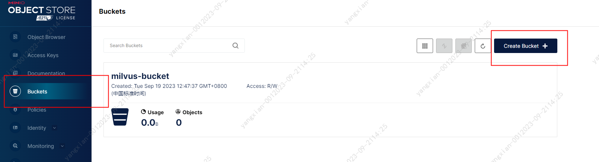
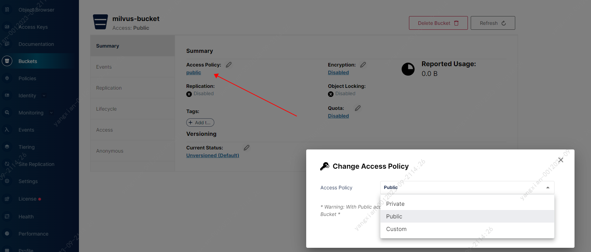
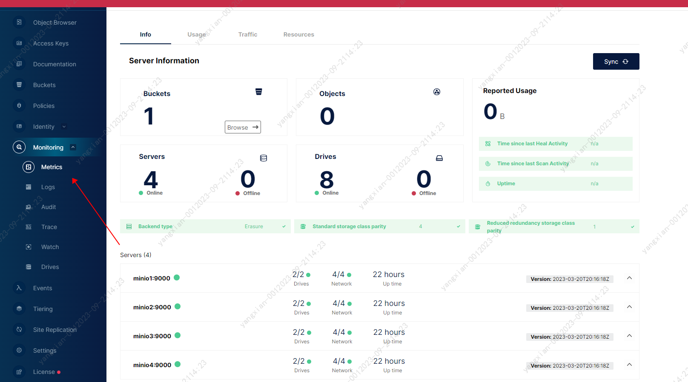

# Etcd & MinIO集群部署

Etcd和MinIO子集群在Milvus集群中属于被依赖的服务角色，因此我们首先完成这两个子集群的搭建工作。Etcd主要用于存储Milvus中各个节点的元信息数据，MinIO用于存储Milvus中的实际向量数据，Milvus本身只用于构建索引、查询，其本身并不存储数据。Etcd共有3个节点，其Docker Node节点标签为前缀zk. MinIO共有4个节点，其节点标签为minio，MinIO节点用于存储数据，该4个节点分别外挂了1000G的存储空间。

## 1. 准备工作

## 1.1 Etcd节点
根据对26台主机的规划，ZooKeeper与Etcd公用如下3个节点，详细信息如下：
```bash
=======================================================================
 hostname           ip                   id                   role 
-----------------------------------------------------------------------
gp22aitppapcsve  29.16.21.75  feat9cenkv7h5itauklaueqp6      zk1,etcd1
gp22aitppap92xg  29.16.21.76  lwzi92s62589xhej0y4o40xkk      zk2,etcd2
gp22aitppapch5z  29.16.21.77  u8n1y8aosgaaov2bhhmucdduh      zk3,etcd3
=======================================================================
```

我们在``/mnt/data``目录下建立相应的目录供etcd节点使用。在``29.16.21.75~29.16.21.77``共3个节点上分别执行如下操作：
```bash
# 1. 在29.16.21.75上执行如下命令
mkdir -p /mnt/data/etcd

# 2. 在29.16.21.76上执行如下命令
mkdir -p /mnt/data/etcd

# 3. 在29.16.21.77上执行如下命令
mkdir -p /mnt/data/etcd
```

该目录用于持久化存储Etcd的数据。


## 1.2 MinIO节点

MinIO独占如下4个节点，详细信息如下：
```bash
=======================================================================
 hostname           ip                   id                   role 
-----------------------------------------------------------------------
gp22aitppapwc2g  29.16.21.83  w9qfcpvtfstnxsudcom2wj6ii        minio1
gp22aitppapxpeg  29.16.21.84  wbhf2nmlx3jrfekfq76l582d0        minio2
gp22aitppap7keb  29.16.21.85  qmq7uiblozdfkuwptvddppeoo        minio3
gp22aitppapnch3  29.16.21.86  t2ka3dmgb9o30vynhdqzo35cd        minio4
=======================================================================
```

我们在``/mnt/data``目录下建立相应的目录供etcd节点使用。在``29.16.21.83~29.16.21.86``共3个节点上分别执行如下操作：
```bash
# 1. 在29.16.21.83上执行如下命令
mkdir -p /mnt/data/disk1
mkdir -p /mnt/data/disk2

# 2. 在29.16.21.84上执行如下命令
mkdir -p /mnt/data/disk1
mkdir -p /mnt/data/disk2

# 3. 在29.16.21.85上执行如下命令
mkdir -p /mnt/data/disk1
mkdir -p /mnt/data/disk2

# 4. 在29.16.21.86上执行如下命令
mkdir -p /mnt/data/disk1
mkdir -p /mnt/data/disk2
```

在每个MinIO节点上，分别创建2个disk目录用于挂载到容器内以持久化存储数据。


## 1.3 Manager节点
由于MinIO软件自身没有代理或者负载均衡的功能，因此我们需要额外为其搭建负载均衡服务，根据官方的推荐，我们使用Nginx作为其Load Blancer. 我们已提前将相关的负载均衡配置完成，并存放于[./conf/nginx/nginx.conf](./conf/nginx/nginx.conf). 

根据规划，我们将所有的代理都运行与管理节点，所以我们需要将该配置文件分别拷贝至3个管理节点``29.16.21.80~29.16.21.82``的``/home/dcos``目录。我们现将其拷贝至80节点，然后执行如下命令：
```bash
scp nginx.conf docs@29.16.21.81:/home/dcos
scp nginx.conf docs@29.16.21.82:/home/dcos
```

【备注】：因为我们平时的操作在80节点的``/home/dcos``目录，并且在Docker Stakc YAML文件中使用了相对路径的映射，因此需要将相关的配置文件都存放于相同的目录，以免容器启动时找不到相关的文件.


## 2. 集群搭建

## 2.1 服务部署
Etcd和MinIO集群和相关的代理服务配置我们已准备在[./yaml/etcd-minio.yaml](./yaml/etcd-minio.yaml)中，将其上传至80节点，然后执行如下命令：
```bash
[dcos@gp22aitppap3jmy-M3~]$ docker stack deploy --compose-file  etcd-minio.yaml milvus
Creating service milvus_minio1
Creating service milvus_minio2
Creating service milvus_minio3
Creating service milvus_minio4
Creating service milvus_minio-proxy
Creating service milvus_etcd1
Creating service milvus_etcd2
Creating service milvus_etcd3
Creating service milvus_etcd-proxy
```

## 2.2 服务查看
```bash
[dcos@gp22aitppap3jmy-M3~]$ docker stack ps  milvus --no-trunc
j6njxqb8ii8sydri3kjf289bt   milvus_minio-proxy.1         nginx:latest    gp22aitppapvgr5  Running    Running 22 hours ago                                 *:9000->9000/tcp,*:9090->9090/tcp
umloqegy47bfz9hopghaxebfs    \_ milvus_minio-proxy.1     nginx:latest    gp22aitppapvgr5  Shutdown   Failed 22 hours ago    "task: non-zero exit (1)"     
7ox0nmjiia7nygt7975hnm8u1   milvus_etcd1.1               etcd:v3.5.5     gp22aitppapcsve  Running    Running 22 hours ago                                 
wd1th58fdninouczqcd6nejcp   milvus_minio4.1              minio:v23.03    gp22aitppapnch3  Running    Running 22 hours ago                                 
ynyt5hvnhiigee93kmg4lp2qm   milvus_minio2.1              minio:v23.03    gp22aitppapxpeg  Running    Running 22 hours ago                                 
5y8rlgd9f5r96bz2ht65x81de   milvus_etcd-proxy.1          etcd:v3.5.5     gp22aitppapvgr5  Running    Running 22 hours ago                                 *:2379->23790/tcp
twkyb64dywegj5mw1s2qzljys   milvus_etcd2.1               etcd:v3.5.5     gp22aitppap92xg  Running    Running 22 hours ago                                 
z2npphphudll9r5gfxrrrv46c   milvus_minio3.1              minio:v23.03    gp22aitppap7keb  Running    Running 22 hours ago                                 
l4eq8r20bp43jq2fq1djud3uq   milvus_minio1.1              minio:v23.03    gp22aitppapwc2g  Running    Running 22 hours ago                                 
yvp5inzf6k55inzukxnw1qq6r   milvus_etcd3.1               etcd:v3.5.5     gp22aitppapch5z  Running    Running 22 hours ago                                 
lstyq5mzjrhr4xk8sb9s87vi8   milvus_milvus-proxy.2        milvus:v2.3.0   gp22aitppap3jmy  Running    Running 21 hours ago                                 *:19530->19530/tcp,*:9091->9091/tcp
igtpq5efw5plyum8461tjelgn   milvus_minio-proxy.2         nginx:latest    gp22aitppap3jmy  Running    Running 22 hours ago                                 *:9090->9090/tcp,*:9000->9000/tcp
uj9qlxly26woh8sod9077i3do    \_ milvus_minio-proxy.2     nginx:latest    gp22aitppap3jmy  Shutdown   Failed 22 hours ago    "task: non-zero exit (1)"     
jit2auai9y613loh0hamu2nys   milvus_etcd-proxy.2          etcd:v3.5.5     gp22aitppap3jmy  Running    Running 22 hours ago                                 *:2379->23790/tcp
```

我们发现其中部分容器有重启的迹象，这是是正常现象。因为两个代理服务依赖于底层服务，因此当代理服务起来发现底层服务尚不可用时，就会发生重启，我们只需要稍等一会儿即可，等待所有的服务都处于``Running``的状态.


## 3. 集群检验

## 3.1 Etcd服务查验

我们在任何一个有``etcd:v3.5.5``镜像的节点上启动一个临时容器，该镜像内有etcd的中端工具，我们使用该工具连接我们的etcd代理，如下：
```bash
# 1. 创建一个容器，并使用miluvs集群的网络，不然网络不同
[dcos@gp22aitppap3jmy-M3~]$ docker run --rm --network=milvus_milvus-cluster-net -it etcd:v3.5.5 bash


# 2. 使用etcd代理创建一个key-value对
root@etcd1:/# etcdctl  put  name yangxian --endpoints=etcd-proxy:23790
OK

# 3. 通过代理查看该key
root@etcd1:/# etcdctl  get  name          --endpoints=etcd-proxy:23790
name
yangxian

# 4. 依次在被代理的3个节点上查看该key是否存在
root@etcd1:/# etcdctl  get  name  --endpoints=etcd1:2379
name
yangxian


root@etcd1:/# etcdctl  get  name  --endpoints=etcd2:2379
name
yangxian


root@etcd1:/# etcdctl  get  name  --endpoints=etcd3:2379
name
yangxian

# 5. 通过代理删除该key
root@etcd1:/# etcdctl  del  name  --endpoints=etcd-proxy:23790
1

```

如果上述命令都能正确输出，说明etcd集群和其已经准备就绪.


## 3.2 MinIO服务查验

在部署MinIO服务时，我们已经将MinIO的代理服务对主机做了端口映射，我们可以直接在本地浏览器访问29.16.21.80:9090端口，输入MinIO服务的用户名和密码访问服务：


我们输入用户名和密码即可进入访问. 进入后我们寿险点击左侧的``Bukcet``菜单，建立一个新的桶，供Milvus存储相关的向量的数据，桶名我们取为``milvus-bucket``，此名字需要与后续Milvus的配置一致，我们后续会讲到。




桶创建后，我们需要为其赋值Pubic权限，如下：



此时，我们点击左侧的``Monitering->Metrics``查看MinIO集群的磁盘使用状态：



到此，我们MinIO集群和代理我们就搭建成功了。


## 参考文档
1. MinIO安装: https://min.io/download#/linux
2. etcd下载: https://github.com/etcd-io/etcd/releases
3. Grafana安装教程: https://grafana.com/docs/grafana/latest/setup-grafana/installation/debian/#install-from-apt-repository